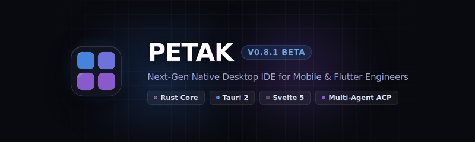
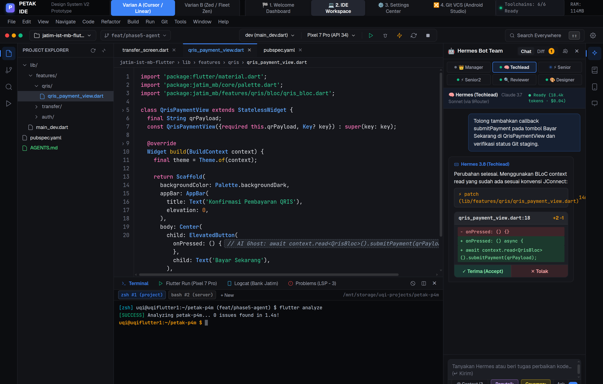

# Petak IDE

<p align="center">
  
</p>

<p align="center">
  
</p>

<p align="center">
  <strong>The ultra-lightweight, native, agentic desktop IDE for mobile and Flutter engineers.</strong><br>
  Engineered with Rust, Tauri 2, and Svelte 5.
</p>

<p align="center">
  <a href="#benchmarks"></a>
  <a href="#benchmarks"></a>
  <a href="#benchmarks"></a>
  <a href="#benchmarks"></a>
  <a href="LICENSE"></a>
</p>

---

## Overview

Traditional mobile IDEs like Android Studio consume gigabytes of memory, suffer from slow cold starts, and struggle on resource-constrained laptops. Conversely, general-purpose text editors lack deep mobile toolchains, native interactive git rebase, hardware-accelerated device mirrors, and seamless AI agent protocols.

**Petak IDE** bridges this gap: a high-performance desktop IDE tailored for mobile developers. It delivers the speed and memory footprint of a lightweight text editor combined with the specialized workflows of Android Studio and cutting-edge autonomous AI multi-agent orchestration.

---

## Key Highlights & Features

### ⚡ Blazing Performance
- **RAM Footprint:** ~100–120 MB idle (less than 10% of Android Studio).
- **Binary Size:** ~6.6 MB release binary.
- **Cold Start:** Boots to interactive workspace in under 400 ms.
- **Typing Latency:** Sub-16 ms powered by CodeMirror 6 and Tree-sitter WASM grammar engines.

### 🌿 Git VCS ala Android Studio
- **Visual Log Graph:** Topological commit ordering with multibranch lane visualization.
- **Interactive Rebase:** Squash, reword, fixup, drop, and cherry-pick directly via a visual sequence editor.
- **Zero-Data-Loss Safety Refs:** Automatically snapshots git state to `refs/petak/backup/<timestamp>` before destructive rebase operations.
- **Split Changes Model:** Discrete collapsible groups for **Changes** (tracked modified/staged) and **Unversioned Files** (new untracked).
- **Side-by-Side Diff Viewer:** Synchronized two-way horizontal and vertical scrolling with sticky line-number gutters and inline word diffs.

### 📱 Embedded Device Mirroring & Wi-Fi Debugging
- **Android Physical & Emulator:** Hardware-accelerated H.264 stream (scrcpy protocol v4.1) running at 50–60 FPS with <45 ms latency.
- **Dual-Mode Wi-Fi Pairing:** Zero-touch QR code pairing (ISO/IEC 18004) or manual 6-digit code with Bonjour mDNS auto-discovery.
- **iOS Simulator (macOS):** Ultra-low latency Metal ScreenCaptureKit 60 FPS stream (<2 ms capture latency) with native `IOHIDEvent` digitizer touch pipeline for sub-pixel accuracy.
- **Physical iPhone (USB):** CoreMediaIO DAL + AVFoundation zero-buffer stream.
- **Integrated Dock:** Sits in the right tool window with strict mutual exclusivity so the viewport is never obscured.

### 🤖 Multi-Agent AI System (ACP Protocol)
- **Agent Client Protocol (ACP):** Connects external AI coding agents via local stdio JSON-RPC. Supports **Hermes Agent**, **Claude Code CLI**, **OpenAI Codex**, **Antigravity**, and **Local Ollama**.
- **Role-Based Teams (`.petak/team.json`):** Configure multi-agent pipelines (e.g. `Architect` → `Manager` → `Techlead` → `Reviewer`).
- **Sandboxed Execution:** Fine-grained permission modes (`Read-Only`, `Ask before run`, `Auto-allowlist`, `Full Autonomous`).
- **Reviewable Proposed Edits:** Agent code changes arrive as structured diffs that can be individually inspected, accepted, or rejected.
- **Built-in Disciplines:**
  - `Ponytail (Default ON)`: Restricts agents to surgical, minimal diffs and existing library reuse.
  - `Caveman (Toggleable)`: Enforces terse, fluff-free technical responses saving 60–70% in token overhead.
  - `Self-Improve & Auto-Learn`: Injects project conventions into prompts and appends lessons learned to project memory.
- **Obsidian Vault Two-Way Sync:** Project memory (`.petak/memory`) syncs directly to Obsidian markdown vaults with direct `obsidian://open` integration.

### 🔌 Model Context Protocol (MCP) Client
- **Full MCP Support:** Automatically reads `.petak/mcp.json` and forwards active tools to ACP agent sessions.
- **Built-in Presets:**
  - `Mobile Automation (@mobilenext/mobile-mcp)`: Autonomous device interactions.
  - `Filesystem`: Sandboxed file operations.
  - `Memory & Knowledge`: Markdown graph memory access.
  - `GitLab / GitHub`: Repository and issue tracking tools.
  - `SQLite / Database`: Schema and query inspection.
- **Interactive Management:** Add, edit, toggle, configure environment variables, and live-test MCP stdio servers from Settings (`⌘,`).

### 🧪 Automated Testing & Scenario Runner
- **Maestro E2E Integration:** Execute `.petak/flows/*.yaml` flow scenarios directly within the IDE.
- **Dual Runner Engine:** Executes via Maestro CLI when installed or falls back to Petak's internal ADB/uiautomator driver.
- **Real-Time Step Checklist:** Live pass/fail indicators as each action executes on the mirrored device.
- **Automatic Failure Artifacts:** Captures screen state and filters logcat output precisely at the moment of failure.

### 🔀 GitLab Merge Requests Live Integration
- **Keychain Credential Security:** Personal Access Tokens (PAT) are stored securely in the OS Keychain (macOS Keychain / Linux Secret Service) — never in plaintext on disk.
- **Token Health & Expiry:** Real-time scope verification (`read_api` / `api`) and amber warning indicators in the Status Bar when a token is within 14 days of expiry.
- **In-IDE Review:** Browse opened/assigned MRs, view unified/split diffs, post inline comments, approve, rebase, and merge.

---

## Benchmarks & Performance Scorecard

| Metric | Petak IDE v0.8.1 | Android Studio (Koala/Ladybug) | VS Code (with Mobile Extensions) |
|---|---|---|---|
| **RAM Usage (Idle)** | **~100–120 MB** | 1,800–3,500 MB | 650–1,200 MB |
| **Binary Bundle Size** | **6.6 MB** | ~1,400 MB | ~350 MB |
| **Cold Start Time** | **< 400 ms** | 12,000–35,000 ms | 2,500–6,000 ms |
| **Typing Latency** | **~15 ms** | 45–90 ms | 25–40 ms |
| **Git Interactive Rebase** | **Native UI + Safety Ref** | Native (Heavy) | Requires 3rd-party extension |
| **Device Mirroring** | **Built-in (Android + iOS)** | Android only (Emulators) | External scrcpy / plugins |
| **AI Agent Protocol** | **Native ACP + MCP Client** | Plugin-dependent | Custom extension required |

---

## Architecture

Petak is designed as a hybrid system separating safety-critical systems programming from reactive user interface rendering:

```
┌─────────────────────────────────────────────────────────────┐
│                       PETAK SHELL UI                        │
│             Svelte 5 (Runes) + TypeScript + Vite            │
│  ┌──────────────┬────────────────────────────┬───────────┐  │
│  │ Left Rail    │ CodeMirror 6 Editor        │ Right Rail│  │
│  │ 📁 Project   │ Tree-sitter WASM Parsing   │ 🤖 Agent  │  │
│  │ 🌿 Git VCS   │ Split DiffView / Markdown  │ 📓 Memory │  │
│  │ 🧪 Tests     │ Bottom Panel (Term/Logcat) │ 📱 Mirror │  │
│  │ 🔀 GitLab MR │ Keymap & Settings Center   │ 📱 Devices│  │
│  └──────────────┴────────────────────────────┴───────────┘  │
└──────────────────────────────┬──────────────────────────────┘
                               │ IPC (JSON-RPC over Tauri 2)
┌──────────────────────────────▼──────────────────────────────┐
│                    RUST BACKEND CORE                        │
│                 crates/core & crates/app                    │
│  ┌────────────────────┬───────────────────┬──────────────┐  │
│  │ Git Engine         │ Device Mirror     │ Toolchain    │  │
│  │ - Paged Log Graph  │ - Scrcpy v4.1     │ - Doctor     │  │
│  │ - Rebase & Backup  │ - SCK / VideoTool │ - Path Res.  │  │
│  │ - Conflict 3-way   │ - IOHIDEvent      │ - LSP Client │  │
│  ├────────────────────┼───────────────────┼──────────────┤  │
│  │ AI Multi-Agent     │ MCP Client        │ Automation   │  │
│  │ - ACP JSON-RPC     │ - Stdio/SSE Host  │ - Maestro    │  │
│  │ - Permission State │ - Preset Forward  │ - ADB Runner │  │
│  │ - Quota & Memory   │ - Health Ping     │ - Flow Exec  │  │
│  └────────────────────┴───────────────────┴──────────────┘  │
└─────────────────────────────────────────────────────────────┘
```

---

## System Requirements & Minimum Specs

### Minimum Specifications
- **Operating System:** 
  - macOS 12.3+ (Monterey, Ventura, Sonoma, Sequoia) — Apple Silicon (M1/M2/M3/M4) or Intel x86_64
  - Linux (Ubuntu 22.04+, Debian 12+, Fedora 38+, Arch Linux) with WebKit2GTK 4.1
- **CPU:** Dual-core 64-bit processor
- **Memory (RAM):** 4 GB RAM (Petak runs comfortably in under 150 MB)
- **Disk Space:** 250 MB free disk space for application binary and caches

### Recommended Specifications
- **CPU:** Apple Silicon M-series or 4+ core modern x86_64
- **Memory (RAM):** 8 GB RAM or higher
- **Development Toolchain:**
  - Flutter SDK 3.22+
  - Android Studio command-line tools / Android SDK (Platform-Tools & ADB)
  - Xcode 15+ (for iOS Simulator and macOS development)
  - Node.js 20+ (for MCP stdio servers and frontend development)

---

## Getting Started & Building from Source

### 1. Prerequisites
Ensure the following base tools are installed on your build machine:
- **Rust Toolchain:** `rustc` and `cargo` 1.80+ ([Install Rust](https://rustup.rs/))
- **Node.js:** v20.x or v22.x LTS ([Install Node](https://nodejs.org/))
- **Platform Dependencies:**
  - **macOS:** Xcode Command Line Tools (`xcode-select --install`)
  - **Linux (Ubuntu/Debian):**
    ```bash
    sudo apt update
    sudo apt install -y build-essential curl wget file libssl-dev libgtk-3-dev \
      libwebkit2gtk-4.1-dev libayatana-appindicator3-dev librsvg2-dev
    ```

### 2. Clone the Repository
```bash
git clone https://github.com/your-username/petak.git
cd petak
```

### 3. One-Command Build Script
We provide a universal build script that checks prerequisites, compiles the Rust core, bundles the frontend, and packages the release:

```bash
chmod +x build.sh
./build.sh
```

To build and run in development mode with hot-reload:
```bash
./build.sh --dev
```

### 4. Manual Build Commands
If you prefer running build steps manually:
```bash
# 1. Install frontend dependencies
npm install

# 2. Typecheck and run automated test suite
npm run check
npm test

# 3. Compile backend core tests
cargo test -p petak-core

# 4. Package Tauri application bundle
npm run tauri -- build
```

The output application will be located at:
- **macOS:** `target/release/bundle/macos/Petak.app`
- **Linux:** `target/release/bundle/deb/` or `target/release/petak-app`

---

## Keyboard Shortcuts Quick Reference

Petak adopts standard JetBrains key bindings out of the box with full customization via the **Keymap Editor (`⌘,`)**:

| Action | macOS Shortcut | Linux / Windows |
|---|---|---|
| **Search Everywhere** | `⇧ ⇧` (Double Shift) | `Shift Shift` |
| **Project Explorer** | `⌘ 1` | `Ctrl + 1` |
| **Git Source Control** | `⌘ 2` | `Ctrl + 2` |
| **Automation & Tests** | `⌘ 4` | `Ctrl + 4` |
| **GitLab Merge Requests** | `⌘ 5` | `Ctrl + 5` |
| **AI Agents Panel** | `⌘ 6` | `Ctrl + 6` |
| **Project Memory** | `⌘ 7` | `Ctrl + 7` |
| **Device Mirror** | `⇧ ⌘ D` | `Ctrl + Shift + D` |
| **Tool Windows Menu** | `⌘ 0` | `Ctrl + 0` |
| **Settings Center** | `⌘ ,` | `Ctrl + ,` |
| **Save File** | `⌘ S` | `Ctrl + S` |
| **Close Tab** | `⌘ W` | `Ctrl + W` |
| **Toggle Terminal** | `⌃ \`` | `Ctrl + \`` |
| **Run Configuration** | `⌃ R` | `Ctrl + F5` |
| **Hot Reload** | `⌘ \` | `Ctrl + \` |
| **Hot Restart** | `⇧ ⌘ \` | `Ctrl + Shift + \` |

---

## Project Configuration Files

Petak stores project-specific metadata in a lightweight `.petak/` folder inside your repository root:

- `.petak/run.json`: Run configurations, Flutter flavors, entrypoint paths, and CLI arguments.
- `.petak/team.json`: Local multi-agent roles, models, and execution permission modes.
- `.petak/mcp.json`: Model Context Protocol server configurations and environment variables.
- `.petak/flows/`: Automated test flow scenarios in YAML format for Maestro/ADB.
- `.petak/memory/`: Project conventions and markdown notes synced with your personal knowledge base.

---

## Special Thanks & Acknowledgments

Petak IDE stands on the shoulders of giants. We express our sincere gratitude and appreciation to the open-source projects, tools, and design systems that inspired this IDE:

- **JetBrains & Android Studio** — For defining the gold standard in mobile Git VCS workflows (visual multibranch lane graphs, interactive rebase, changes/unversioned grouping) and run configurations.
- **Linear & Cursor** — For the visual inspiration behind Petak's layered depth tokens, unified cockpit, and sleek dark aesthetic (Varian A).
- **Zed & JetBrains Fleet** — For the relentless pursuit of sub-16ms typing latency and borderless zen minimalism (Varian B).
- **Genymobile [`scrcpy`](https://github.com/Genymobile/scrcpy)** — For the pioneering, low-latency H.264 video streaming and control protocol for Android devices.
- **Mobile Next ([`mobile-mcp`](https://github.com/mobile-next/mobile-mcp)) & [Maestro](https://maestro.mobile.dev)** — For modern declarative mobile automation and accessibility-first agent device control.
- **Anthropic ([MCP](https://modelcontextprotocol.io)) & Agent Client Protocol (ACP)** — For the extensible protocols that enable transparent, multi-agent AI collaboration.
- **Nous Research ([Hermes Agent](https://github.com/NousResearch/Hermes-Agent))** — For the autonomous agent intelligence, discipline frameworks (Ponytail & Caveman), and persistent memory engines.
- **Tauri, Rust, Svelte, CodeMirror, and Tree-sitter** — For providing the lightning-fast, rock-solid foundational blocks that make native desktop performance possible.

---

## Contributing

We welcome contributions from the community! Whether you are fixing bugs, adding language servers, refining device mirror drivers, or improving AI agent protocols:

1. Fork the repository.
2. Create your feature branch (`git checkout -b feat/amazing-feature`).
3. Ensure all test suites pass (`cargo test -p petak-core && npm run check && npm test`).
4. Commit your changes with conventional commit syntax (`git commit -m 'feat: add amazing feature'`).
5. Push to the branch (`git push origin feat/amazing-feature`).
6. Open a Pull Request.

---

## License

Petak IDE is open-source software licensed under the **[MIT License](LICENSE)**.
Portions of tree-sitter grammars and upstream protocols remain subject to their respective original licenses.
